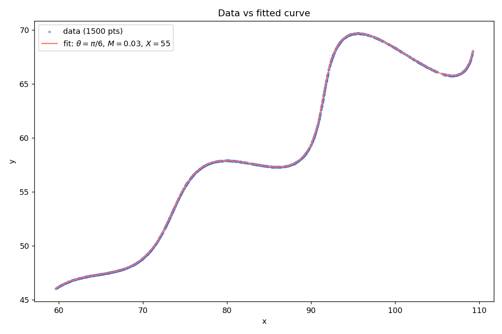

# Curve fitting assignment

Three unknowns to recover from a parametric curve, given 1500 (x, y) points sampled at unknown t values in (6, 60):

$$x(t) = t\cos\theta - e^{M|t|}\sin(0.3t)\sin\theta + X$$

$$y(t) = 42 + t\sin\theta + e^{M|t|}\sin(0.3t)\cos\theta$$

## Answer

    theta = 30 deg = pi/6 (about 0.523599 rad)
    M     = 0.03
    X     = 55

Paste this into Desmos to see it:

```latex
\left(t\cos(0.523599)-e^{0.03\left|t\right|}\cdot\sin(0.3t)\sin(0.523599)+55,\ 42+t\sin(0.523599)+e^{0.03\left|t\right|}\cdot\sin(0.3t)\cos(0.523599)\right)
```



## Method

The equations are less scary than they look. Write w(t) = e^(Mt) sin(0.3t). The |t| does nothing here since t is always positive. Then the curve is the point (t, w(t)) rotated by theta and shifted by (X, 42). A wavy line, tilted and moved. That single observation does most of the work.

The csv only has x and y. The t behind each point is missing and the rows are shuffled. Sounds bad, until you remember rotations are easy to undo. For any candidate (theta, M, X), rotate each point back:

    t = (x - X) cos(theta) + (y - 42) sin(theta)
    v = -(x - X) sin(theta) + (y - 42) cos(theta)

If the candidate is right, v has to equal w(t) at every single point. So instead of a problem with 1500 hidden t values, we get a plain three-variable least squares: minimize v - e^(Mt) sin(0.3t) across the data. I used scipy's `least_squares` with the box bounds from the problem statement.

One wrinkle. sin(0.3t) has a period of about 21 in t, so a bad starting guess can settle one period off and stay there. To avoid that I restart the solver from a coarse grid of theta and X values and keep the best result. Every sensible start ends up at the same minimum anyway.

## Checking the result

The solver lands at theta = 29.999973 deg, M = 0.0299999969, X = 54.9999982. When a fit comes out that close to round numbers, the intended values are obviously 30 deg, 0.03 and 55.

Residual RMS is 3.5e-6, which matches the float32 rounding of the csv itself, so the fit is exact up to how the data was stored. The recovered t values run from 6.05 to 59.99, inside the stated (6, 60). Summed L1 error over all 1500 points is about 0.005. The plot above has the fitted curve drawn over the data and you cannot see daylight between them.

## Files

- `solve.py` fits the parameters and prints them along with the latex string
- `fit_overlay.png` shows the data with the fitted curve on top
- `xy_data.csv` is the given dataset

## Run

```
pip install numpy scipy pandas
python solve.py
```
